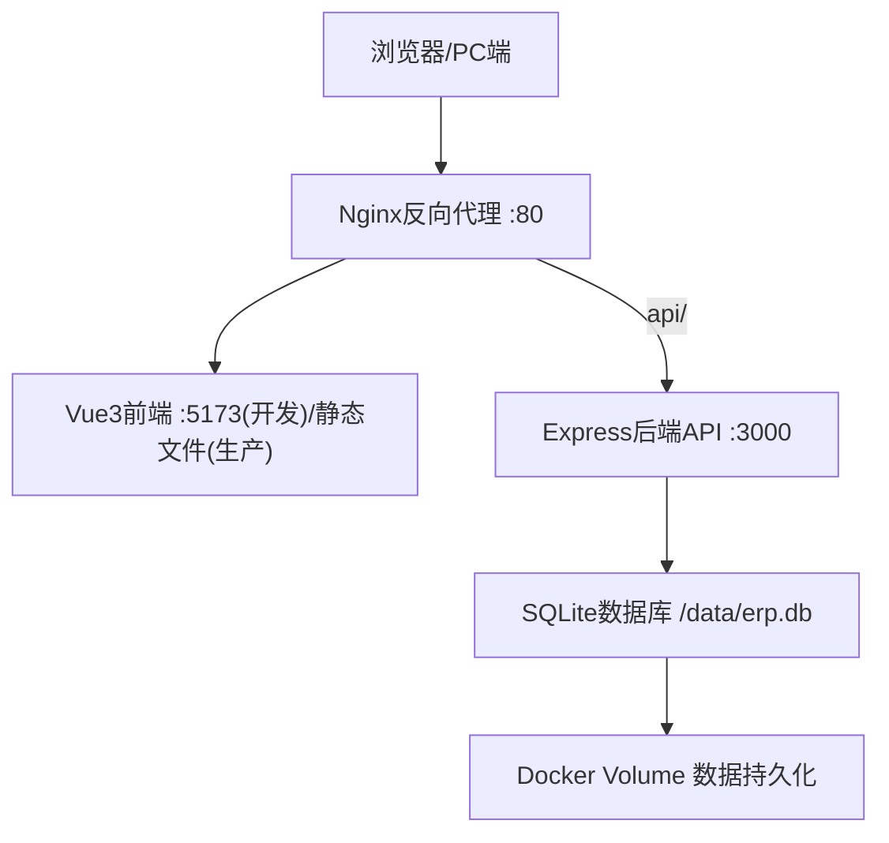
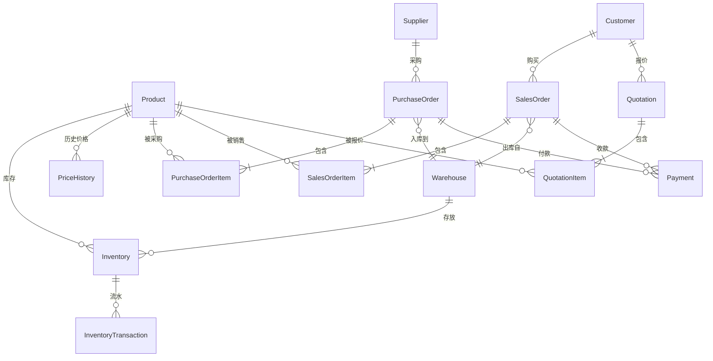

# 供销存管理系统 - 技术设计文档

Feature Name: erp-inventory-system
Updated: 2026-09-06

## Description

基于 Vue3 + Node.js/Express + SQLite 的供销存管理系统。前后端分离，Docker 容器化部署，单端口对外访问。中文界面，PC端优先，预留 RESTful API 供后期移动端 APK 接入。

## Architecture



### 技术栈选型

| 层级 | 技术 | 版本 | 理由 |
|------|------|------|------|
| 前端框架 | Vue3 + Vite | latest | 轻量快速，中文生态好 |
| UI组件库 | Element Plus | latest | 中文后台管理系统首选，组件丰富 |
| 状态管理 | Pinia | latest | Vue3官方推荐 |
| 路由 | Vue Router 4 | latest | - |
| HTTP客户端 | Axios | latest | - |
| 后端框架 | Express.js | latest | 轻量灵活，Node生态成熟 |
| ORM | Sequelize | latest | 支持SQLite，模型定义清晰 |
| 数据库 | SQLite3 | latest | 零配置，单文件，中小型系统足够，便于Docker持久化 |
| 打印 | 浏览器原生 window.print + CSS @media print | - | 无需额外依赖，适配A4 |
| 反向代理 | Nginx | alpine | 统一入口，前后端同源 |
| 容器化 | Docker + Docker Compose | - | 一键部署 |

## 项目结构

```
/workspace/
├── docker-compose.yml          # 一键启动
├── Dockerfile                  # 后端镜像构建
├── nginx/
│   └── default.conf            # Nginx配置
├── backend/
│   ├── package.json
│   ├── src/
│   │   ├── app.js              # Express入口
│   │   ├── config/
│   │   │   └── database.js     # Sequelize配置
│   │   ├── models/             # 数据模型
│   │   │   ├── index.js
│   │   │   ├── Product.js
│   │   │   ├── Supplier.js
│   │   │   ├── Customer.js
│   │   │   ├── Warehouse.js
│   │   │   ├── PurchaseOrder.js
│   │   │   ├── PurchaseOrderItem.js
│   │   │   ├── SalesOrder.js
│   │   │   ├── SalesOrderItem.js
│   │   │   ├── Quotation.js
│   │   │   ├── QuotationItem.js
│   │   │   ├── Inventory.js
│   │   │   ├── InventoryTransaction.js
│   │   │   ├── Payment.js
│   │   │   └── PriceHistory.js
│   │   ├── routes/             # API路由
│   │   │   ├── products.js
│   │   │   ├── suppliers.js
│   │   │   ├── customers.js
│   │   │   ├── warehouses.js
│   │   │   ├── purchases.js
│   │   │   ├── sales.js
│   │   │   ├── quotations.js
│   │   │   ├── inventory.js
│   │   │   ├── payments.js
│   │   │   └── dashboard.js
│   │   ├── controllers/        # 业务控制器
│   │   ├── services/           # 业务逻辑（事务处理）
│   │   └── utils/
│   │       └── seed.js         # 初始数据种子
│   └── data/                   # SQLite文件挂载点
└── frontend/
    ├── package.json
    ├── vite.config.js
    ├── src/
    │   ├── main.js
    │   ├── App.vue
    │   ├── router/index.js
    │   ├── stores/             # Pinia stores
    │   ├── api/                # Axios API封装
    │   ├── views/              # 页面组件
    │   │   ├── Dashboard.vue
    │   │   ├── products/
    │   │   ├── suppliers/
    │   │   ├── customers/
    │   │   ├── warehouses/
    │   │   ├── purchases/
    │   │   ├── sales/
    │   │   ├── quotations/
    │   │   ├── inventory/
    │   │   └── payments/
    │   ├── components/         # 公共组件
    │   │   ├── Sidebar.vue
    │   │   ├── Header.vue
    │   │   └── PrintTemplate.vue
    │   └── layouts/
    │       └── MainLayout.vue
    └── index.html
```

## Data Models

### 核心表关系ER图



### Product (商品表)

| 字段 | 类型 | 说明 |
|------|------|------|
| id | INTEGER PK | 自增主键 |
| code | STRING UNIQUE | 商品编号 |
| name | STRING | 商品名称 |
| category | STRING | 分类 |
| spec | STRING | 规格 |
| base_unit | STRING | 基础单位 |
| purchase_unit | STRING | 采购单位 |
| purchase_ratio | DECIMAL | 采购单位换算率（1采购单位=X基础单位） |
| sales_unit | STRING | 销售单位 |
| sales_ratio | DECIMAL | 销售单位换算率（1销售单位=X基础单位） |
| cost_price | DECIMAL | 成本价（基础单位） |
| wholesale_price | DECIMAL | 批发价（基础单位） |
| sales_price | DECIMAL | 销售价（基础单位） |
| safety_stock | DECIMAL | 安全库存量 |
| remark | TEXT | 备注 |
| created_at | DATETIME | 创建时间 |
| updated_at | DATETIME | 更新时间 |

### Supplier (供应商表)

| 字段 | 类型 | 说明 |
|------|------|------|
| id | INTEGER PK | |
| code | STRING UNIQUE | 供应商编号 |
| name | STRING | 名称 |
| contact | STRING | 联系人 |
| phone | STRING | 电话 |
| address | STRING | 地址 |
| payable_balance | DECIMAL DEFAULT 0 | 应付款余额 |
| remark | TEXT | 备注 |
| created_at | DATETIME | |

### Customer (客户表)

| 字段 | 类型 | 说明 |
|------|------|------|
| id | INTEGER PK | |
| code | STRING UNIQUE | 客户编号 |
| name | STRING | 名称 |
| contact | STRING | 联系人 |
| phone | STRING | 电话 |
| address | STRING | 地址 |
| level | ENUM('wholesale','retail') | 客户等级 |
| receivable_balance | DECIMAL DEFAULT 0 | 应收款余额 |
| remark | TEXT | 备注 |
| created_at | DATETIME | |

### Warehouse (仓库表)

| 字段 | 类型 | 说明 |
|------|------|------|
| id | INTEGER PK | |
| code | STRING UNIQUE | 仓库编号 |
| name | STRING | 名称 |
| address | STRING | 地址 |
| remark | TEXT | 备注 |

### Inventory (库存表)

| 字段 | 类型 | 说明 |
|------|------|------|
| id | INTEGER PK | |
| product_id | INTEGER FK | 商品ID |
| warehouse_id | INTEGER FK | 仓库ID |
| quantity | DECIMAL DEFAULT 0 | 库存数量（基础单位） |
| UNIQUE(product_id, warehouse_id) | | |

### PurchaseOrder (采购单表)

| 字段 | 类型 | 说明 |
|------|------|------|
| id | INTEGER PK | |
| order_no | STRING UNIQUE | 采购单号 PO+日期+序号 |
| supplier_id | INTEGER FK | 供应商ID |
| warehouse_id | INTEGER FK | 入库仓库ID |
| total_amount | DECIMAL | 采购总金额 |
| paid_amount | DECIMAL DEFAULT 0 | 已付金额 |
| status | ENUM('draft','pending','received','cancelled') | 状态:草稿/待入库/已入库/已取消 |
| pay_status | ENUM('unpaid','partial','paid') | 付款状态 |
| remark | TEXT | 备注 |
| created_at | DATETIME | |
| received_at | DATETIME | 入库时间 |

### PurchaseOrderItem (采购单明细)

| 字段 | 类型 | 说明 |
|------|------|------|
| id | INTEGER PK | |
| order_id | INTEGER FK | 采购单ID |
| product_id | INTEGER FK | 商品ID |
| quantity | DECIMAL | 采购数量（采购单位） |
| base_quantity | DECIMAL | 换算后基础单位数量 |
| unit_price | DECIMAL | 采购单价（采购单位） |
| amount | DECIMAL | 明细金额 |

### SalesOrder (销售订单表)

| 字段 | 类型 | 说明 |
|------|------|------|
| id | INTEGER PK | |
| order_no | STRING UNIQUE | 销售单号 SO+日期+序号 |
| customer_id | INTEGER FK | 客户ID |
| warehouse_id | INTEGER FK | 出库仓库ID |
| total_amount | DECIMAL | 商品金额合计 |
| freight | DECIMAL DEFAULT 0 | 运费 |
| discount_type | ENUM('rate','amount','none') DEFAULT 'none' | 折扣类型 |
| discount_value | DECIMAL DEFAULT 0 | 折扣值（率或金额） |
| discount_amount | DECIMAL DEFAULT 0 | 折扣金额（计算后） |
| receivable_amount | DECIMAL | 应收金额 = 商品金额+运费-折扣 |
| received_amount | DECIMAL DEFAULT 0 | 已收金额 |
| status | ENUM('draft','pending','shipped','cancelled') | 状态:草稿/待出库/已出库/已取消 |
| receive_status | ENUM('unreceived','partial','received') | 收款状态 |
| remark | TEXT | 备注 |
| created_at | DATETIME | |
| shipped_at | DATETIME | 出库时间 |

### SalesOrderItem (销售订单明细)

| 字段 | 类型 | 说明 |
|------|------|------|
| id | INTEGER PK | |
| order_id | INTEGER FK | 销售订单ID |
| product_id | INTEGER FK | 商品ID |
| quantity | DECIMAL | 销售数量（销售单位） |
| base_quantity | DECIMAL | 换算后基础单位数量 |
| unit_price | DECIMAL | 销售单价（销售单位） |
| amount | DECIMAL | 明细金额 |

### Quotation (报价单表)

| 字段 | 类型 | 说明 |
|------|------|------|
| id | INTEGER PK | |
| quote_no | STRING UNIQUE | 报价单号 QT+日期+序号 |
| customer_id | INTEGER FK | 客户ID |
| valid_until | DATE | 有效期至 |
| total_amount | DECIMAL | 商品金额合计 |
| discount_rate | DECIMAL DEFAULT 0 | 整单折扣率 |
| final_amount | DECIMAL | 折扣后金额 |
| status | ENUM('pending','confirmed','expired','converted') | 状态:待确认/已确认/已过期/已转订单 |
| converted_order_id | INTEGER FK | 转为销售订单后的订单ID |
| remark | TEXT | 备注 |
| created_at | DATETIME | |

### QuotationItem (报价单明细)

| 字段 | 类型 | 说明 |
|------|------|------|
| id | INTEGER PK | |
| quotation_id | INTEGER FK | 报价单ID |
| product_id | INTEGER FK | 商品ID |
| quantity | DECIMAL | 报价数量（销售单位） |
| base_quantity | DECIMAL | 换算后数量 |
| unit_price | DECIMAL | 报价单价（销售单位） |
| amount | DECIMAL | 明细金额 |

### InventoryTransaction (库存流水表)

| 字段 | 类型 | 说明 |
|------|------|------|
| id | INTEGER PK | |
| product_id | INTEGER FK | 商品ID |
| warehouse_id | INTEGER FK | 仓库ID |
| type | ENUM('purchase_in','sales_out','transfer_out','transfer_in','adjust_in','adjust_out') | 流水类型 |
| quantity | DECIMAL | 变动数量（基础单位，正数为入库，负数为出库） |
| balance_after | DECIMAL | 变动后库存余额 |
| ref_type | STRING | 关联单据类型 |
| ref_id | INTEGER | 关联单据ID |
| ref_no | STRING | 关联单据编号 |
| remark | TEXT | 备注 |
| created_at | DATETIME | |

### Payment (收付款单表)

| 字段 | 类型 | 说明 |
|------|------|------|
| id | INTEGER PK | |
| payment_no | STRING UNIQUE | 收付款单号 PAY+日期+序号 |
| type | ENUM('receive','pay') | 收款/付款 |
| partner_id | INTEGER | 客户ID或供应商ID |
| partner_type | ENUM('customer','supplier') | 往来方类型 |
| amount | DECIMAL | 收/付金额 |
| method | ENUM('cash','bank_transfer','wechat','alipay','other') | 收付款方式 |
| ref_type | STRING | 关联单据类型 |
| ref_id | INTEGER | 关联单据ID |
| remark | TEXT | 备注 |
| created_at | DATETIME | |

### PriceHistory (历史价格表)

| 字段 | 类型 | 说明 |
|------|------|------|
| id | INTEGER PK | |
| product_id | INTEGER FK | 商品ID |
| customer_id | INTEGER FK | 客户ID |
| unit_price | DECIMAL | 成交单价（销售单位） |
| sales_unit | STRING | 成交时使用的销售单位 |
| order_id | INTEGER FK | 来源销售订单ID |
| order_no | STRING | 来源销售订单号 |
| created_at | DATETIME | 成交日期 |

## Components and Interfaces

### API 接口设计

所有接口统一前缀 `/api`，返回格式：
```json
{ "code": 0, "data": {}, "message": "success" }
```

#### 商品管理
- `GET /api/products` - 商品列表（支持分页、搜索、分类筛选）
- `GET /api/products/:id` - 商品详情
- `POST /api/products` - 新增商品
- `PUT /api/products/:id` - 编辑商品
- `DELETE /api/products/:id` - 删除商品

#### 供应商管理
- `GET /api/suppliers` - 供应商列表
- `GET /api/suppliers/:id` - 供应商详情（含历史采购和付款记录）
- `POST /api/suppliers` - 新增供应商
- `PUT /api/suppliers/:id` - 编辑供应商
- `DELETE /api/suppliers/:id` - 删除供应商

#### 客户管理
- `GET /api/customers` - 客户列表
- `GET /api/customers/:id` - 客户详情（含历史订单、报价和收款记录）
- `POST /api/customers` - 新增客户
- `PUT /api/customers/:id` - 编辑客户
- `DELETE /api/customers/:id` - 删除客户

#### 仓库管理
- `GET /api/warehouses` - 仓库列表
- `POST /api/warehouses` - 新增仓库
- `PUT /api/warehouses/:id` - 编辑仓库
- `DELETE /api/warehouses/:id` - 删除仓库
- `POST /api/warehouses/transfer` - 仓库调拨

#### 采购管理
- `GET /api/purchases` - 采购单列表
- `GET /api/purchases/:id` - 采购单详情
- `POST /api/purchases` - 创建采购单
- `PUT /api/purchases/:id` - 编辑采购单（仅草稿状态）
- `POST /api/purchases/:id/receive` - 确认入库（事务操作：更新库存、成本价、应付款、流水）
- `DELETE /api/purchases/:id` - 删除/取消采购单

#### 销售管理
- `GET /api/sales` - 销售订单列表
- `GET /api/sales/:id` - 销售订单详情
- `POST /api/sales` - 创建销售订单
- `PUT /api/sales/:id` - 编辑销售订单（仅草稿状态）
- `POST /api/sales/:id/ship` - 确认出库（事务操作：扣库存、增应收、记价格历史、流水）
- `GET /api/sales/:id/print` - 获取打印数据
- `DELETE /api/sales/:id` - 删除/取消订单

#### 报价管理
- `GET /api/quotations` - 报价单列表
- `GET /api/quotations/:id` - 报价单详情
- `POST /api/quotations` - 创建报价单
- `PUT /api/quotations/:id` - 编辑报价单
- `POST /api/quotations/:id/convert` - 报价单转销售订单
- `GET /api/quotations/:id/print` - 获取打印数据
- `DELETE /api/quotations/:id` - 删除报价单

#### 库存管理
- `GET /api/inventory` - 库存查询（按仓库、商品筛选）
- `GET /api/inventory/transactions` - 库存流水查询
- `POST /api/inventory/adjust` - 盘点调整

#### 财务管理
- `GET /api/payments` - 收付款单列表
- `POST /api/payments/receive` - 客户收款
- `POST /api/payments/pay` - 供应商付款
- `GET /api/payments/summary` - 收支汇总

#### 仪表盘
- `GET /api/dashboard` - 首页统计数据
- `GET /api/products/price-history?productId=&customerId=` - 获取商品对客户的历史价格

### 前端页面路由

```
/                        → Dashboard 仪表盘
/products                → 商品列表
/products/new            → 新增商品
/products/:id            → 商品详情/编辑
/suppliers               → 供应商列表
/suppliers/:id           → 供应商详情
/customers               → 客户列表
/customers/:id           → 客户详情
/warehouses              → 仓库列表
/purchases               → 采购单列表
/purchases/new           → 新建采购单
/purchases/:id           → 采购单详情
/sales                   → 销售订单列表
/sales/new               → 新建销售订单
/sales/:id               → 销售订单详情
/quotations              → 报价单列表
/quotations/new          → 新建报价单
/quotations/:id          → 报价单详情
/inventory               → 库存查询
/inventory/transactions  → 库存流水
/payments                → 收付款管理
/payments/receive        → 客户收款
/payments/pay            → 供应商付款
```

## Correctness Properties

1. **库存非负约束**: 销售出库时基础单位库存数量不得小于出库数量，否则拒绝出库
2. **金额精度**: 所有金额字段使用 DECIMAL(12,2)，数量使用 DECIMAL(12,4)，避免浮点误差
3. **单据编号唯一**: 采购单号(PO)、销售单号(SO)、报价单号(QT)、收付款单号(PAY) 全局唯一
4. **状态机约束**: 采购单和销售订单的状态流转单向不可逆（草稿→待入库/待出库→已入库/已出库，或→已取消）
5. **数据一致性**: 入库/出库/收付款操作必须在数据库事务中执行，确保库存、金额、流水、余额同步更新
6. **成本价计算**: 加权平均成本法，入库时原子计算
7. **折扣计算**: 应收金额 = 商品金额合计 + 运费 - 折扣金额，所有中间值保留2位小数

## Error Handling

1. **库存不足**: 销售出库时库存不足，返回 400 状态码，提示"商品[{name}]库存不足，当前库存{qty}{unit}，需出库{need}{unit}"
2. **单据状态错误**: 对非草稿状态的单据进行编辑，返回 400，提示"当前单据状态不允许编辑"
3. **关联数据存在**: 删除存在关联单据的基础数据（商品/供应商/客户），返回 400，提示存在未完成单据
4. **数据库事务回滚**: 入库/出库/收付款等联动操作任一环节失败时，整个事务回滚，返回 500 和错误信息
5. **参数校验**: 使用后端中间件对请求参数进行校验，必填字段缺失或格式错误返回 400

## Test Strategy

1. **API单元测试**: 使用 Jest + Supertest 对核心API进行测试
2. **关键事务测试**: 重点测试采购入库、销售出库、收付款的联动逻辑和数据一致性
3. **单位换算测试**: 测试多单位换算的边界情况
4. **成本价计算测试**: 测试多次入库后加权平均成本价的正确性
5. **折扣计算测试**: 测试不同折扣类型下金额计算的正确性

## Docker 部署方案

### docker-compose.yml 服务定义

- **app**: 基于 Node.js 20 alpine 镜像，运行 Express 后端，暴露端口 3000
- **web**: 基于 Nginx alpine 镜像，托管前端静态文件并反向代理 /api 到 app 服务，暴露端口 80
- **数据持久化**: SQLite 数据库文件通过 Docker Volume 挂载到 `/app/data`

### 部署命令

```bash
# 一键启动
docker-compose up -d

# 查看日志
docker-compose logs -f

# 停止
docker-compose down

# 更新升级
docker-compose pull && docker-compose up -d
```

## References

[^1]: Express.js 官方文档 - https://expressjs.com/
[^2]: Sequelize 官方文档 - https://sequelize.org/
[^3]: Element Plus 官方文档 - https://element-plus.org/
[^4]: Vue3 官方文档 - https://vuejs.org/
